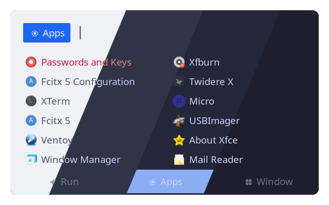
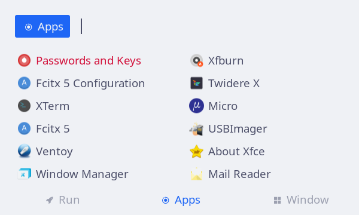
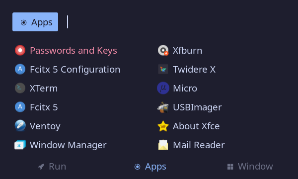

<h3 align="center">
	 
	
	Catppuccin for <a href="https://github.com/davatorium/rofi">Rofi</a>
	
</h3>

    
    
    

## Themes
There are multiple Themes available for rofi:

#### [Basic](https://github.com/catppuccin/rofi/tree/main/basic)
A Catppuccin Port based on [Siduck](https://github.com/siduck)'s dotfiles.

  

## Previews

🌻 Latte

🪴 Frappé

🌺 Macchiato

🌿 Mocha

#### [Deathemonic](https://github.com/catppuccin/rofi/tree/main/deathemonic)
A custom rofi theme based on [Deathemonic](https://github.com/deathemonic/Cat-Dots/tree/v1.4/config/rofi)'s dotfiles including an application launcher, screenshot-, power-, and runmenu.

## 💝 Thanks to

- [AlphaTechnolog](https://github.com/AlphaTechnolog)
- [justTOBBI](https://github.com/justTOBBI)

&nbsp;

	

	Copyright &copy; 2021-present <a href="https://github.com/catppuccin" target="_blank">Catppuccin Org</a>

	

